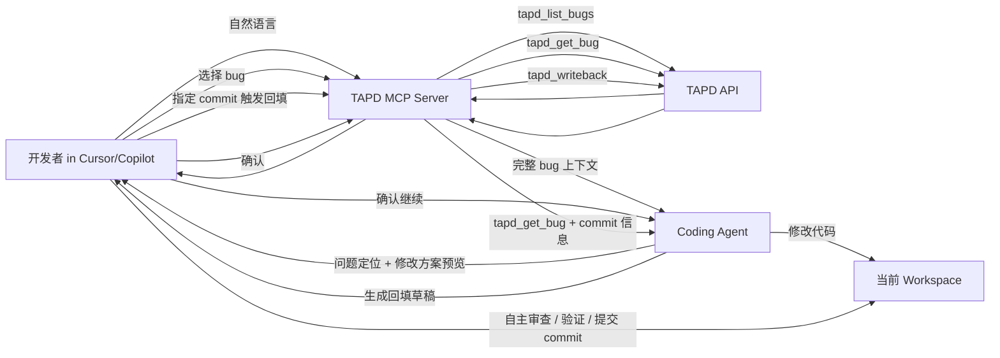

# TAPD Bug Agent Bridge PRD

## 背景与问题

开发者处理 TAPD bug 时，典型路径是：打开 TAPD 查看 bug 描述 → 切到 IDE 搜索代码 → 修改代码 → 提交 commit → 切回 TAPD 手动填写处理评论。这个流程中断了编码节奏，且 TAPD 的上下文（截图、附件、复现步骤）很难自然流入 IDE。

Cursor/Copilot 等 Coding Agent 已具备较强的代码搜索、分析和修改能力，缺少的只是获取 TAPD bug 上下文的通道。本产品不自研代码分析器，而是通过 MCP Server 把 TAPD 数据能力直接接入 Cursor/Copilot，让开发者在 IDE 内完成 bug 处理全流程。

## 产品目标

1. 开发者在 Cursor/Copilot Chat 中直接查询和选择 TAPD bug，无需打开 TAPD 网页。
2. MCP 提供 bug 完整上下文（含图片、附件），宿主 Coding Agent 基于上下文执行定位、修改和验证建议。
3. Agent 可辅助生成 commit message 和可直接回填 TAPD 的评论草稿，是否提交代码与写回 TAPD 均由用户确认。

## 产品路线

| 阶段 | 形态 | 核心价值 |
|------|------|----------|
| 第一版 | TAPD MCP Server | 跑通"查 bug → 分析修复 → 回填"主链路 |
| 第二版 | VS Code 插件 | bug 列表面板、多选、草稿编辑、批量回填 |
| 后续 | Web Console | 团队看板、回填审计、多人协作 |

## 交互流程

### 用户视角

```text
用户：列出我名下待处理的 bug
Agent：找到 3 个 bug：
  [123456] 模型切换后页面空白（高优先级）
  [123457] 筛选重置无效
  [123458] 列表刷新后选中状态丢失

用户：处理 123456
Agent：（调用 tapd_get_bug 获取完整内容，含截图和复现步骤）

       【问题定位】
       components/ai-elements/model-selector.tsx 第 42 行，
       provider 数据为空时未做兜底，导致组件渲染异常，页面空白。

       【修改方案】
       在 provider 列表为空时返回默认选项，避免空状态传入渲染逻辑。
       预计改动范围：model-selector.tsx，约 5 行。

       确认后我来修改代码，是否继续？

用户：继续
Agent：（开始修改代码）

（后续代码审查、验证、提交 commit 由用户自主操作）

---

【批量回填场景】

用户：帮我回填 123456 和 123457，对应的 commit 是 a1b2c3d 和 e4f5g6h
Agent：（调用 tapd_get_bug 获取两个 bug 信息，结合指定 commit 生成草稿）

       [123456] 回填草稿：
       已修复。修改了模型列表在 provider 数据为空时的兜底逻辑。
       commit: a1b2c3d，提交时间：2026-05-19 14:48，修改人：张三。

       [123457] 回填草稿：
       已修复。修正了筛选重置按钮未清空查询参数的问题。
       commit: e4f5g6h，提交时间：2026-05-19 15:12，修改人：张三。

       确认后我来逐个写回 TAPD，是否继续？

用户：确认
Agent：（调用 tapd_writeback × 2）已回填两个 bug，状态均更新为已解决。
```

### 系统流程



## 功能需求

| 工具 | 职责 |
|------|------|
| `tapd_list_bugs` | 查询 bug 列表，支持按负责人、状态、迭代、模块、关键词过滤 |
| `tapd_get_bug` | 获取单个 bug 完整内容，含描述、复现步骤、图片附件；处理多个 bug 时并发调用 |
| `tapd_writeback` | 在 TAPD bug 下回填评论，可选同时更新 bug 状态 |

## 技术概设

| 技术 | 负责环节 |
|------|----------|
| Node.js + TypeScript | MCP Server 运行时 |
| `@modelcontextprotocol/sdk` | MCP 协议实现，工具注册与 stdio transport |
| TAPD REST API | bug 数据读取（list/detail）和回填写入，复用现有 `tapd-client.ts` 逻辑 |
| 环境变量（`TAPD_ACCESS_TOKEN` / `TAPD_WORKSPACE_ID`） | 鉴权凭证注入，通过 `mcp.json` 的 `env` 字段配置，不进代码仓库 |
| MCP Server 附件代理 | TAPD 图片附件鉴权转发 |
| Cursor / VS Code Copilot | 代码搜索、分析、修改、验证建议、commit message 和回填草稿生成，MCP 不介入 |

## 非目标

- 不自研代码搜索或分析逻辑
- 第一版不做 VS Code 插件和 Web Console
- 不绕过用户确认直接回填 TAPD
- MCP 不提交代码；Agent 可辅助生成 commit message，是否提交由用户决定

## 约束

- 回填必须由用户在对话中确认后触发
- 凭证本地配置，不经任何中间服务器
- MCP Server 只读写 TAPD，不访问本地文件系统
