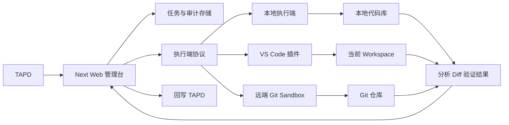
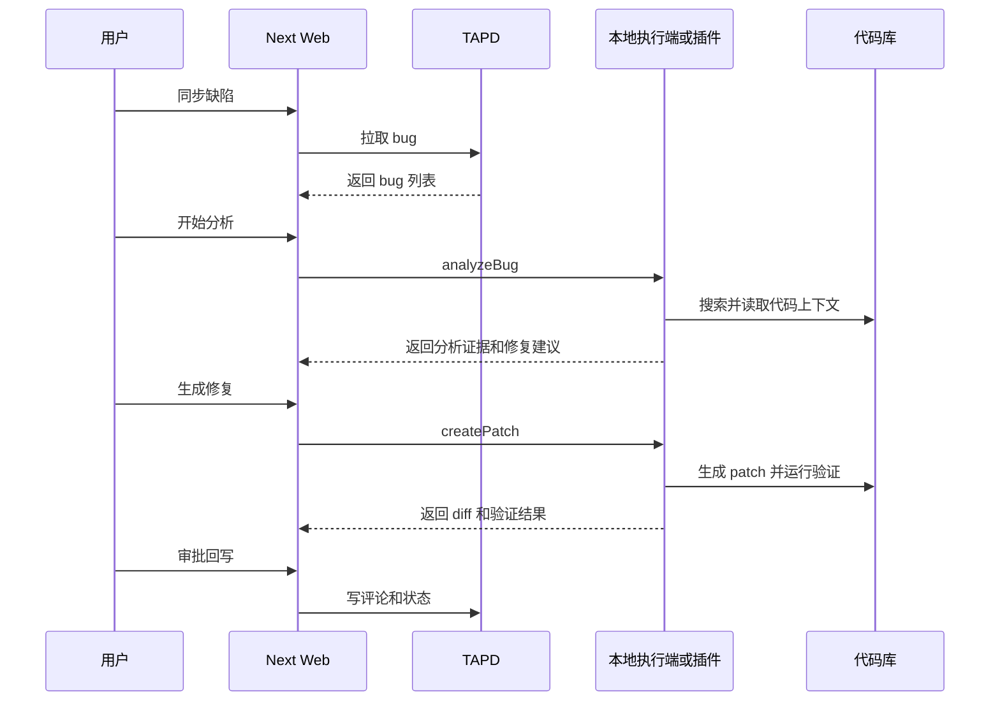

# Web + 本地执行端/插件架构方案

## 产品形态

采用混合架构：

- Next Web 管理台：负责 TAPD 缺陷同步、任务队列、分析/修复状态展示、审计日志、人工审批、TAPD 回写。
- 本地执行端：负责访问本地代码库、检索文件、调用 AI 分析、生成 patch、运行验证命令。
- VS Code 插件：作为本地执行端的增强形态，复用执行协议，在 IDE 内提供选择 bug、查看分析、应用 diff、打开相关文件等体验。
- 远端 Git Sandbox：作为后续正式团队版执行端，在隔离环境 clone 仓库、修复、验证、创建 PR。

## 核心边界

### Web 管理台

现有页面可以继续沿用 `components/tapd-agent/bug-agent-console.tsx`，但它不直接做代码操作，只发起任务和展示结果。

现有服务层 `lib/tapd-agent/service.ts` 需要从同步函数改成任务编排层：创建分析任务、创建修复任务、记录状态、接收执行端结果。

TAPD 相关能力继续放在 `lib/tapd-agent/tapd-client.ts`，保持它只负责拉 bug 和回写，不参与代码分析。

### 执行端协议

新增一层抽象，比如 `lib/tapd-agent/executor/`：

- `ExecutorClient`：Web 调用执行端的统一接口。
- `ExecutorServer`：本地执行端或插件暴露的能力。
- `ExecutorResult`：标准化返回分析、patch、验证结果、日志。

建议先定义这些能力：

- `getWorkspaceInfo()`：返回仓库路径、分支、commit、package manager。
- `analyzeBug(input)`：基于 bug 信息和代码库生成分析结果。
- `createPatch(input)`：生成修复 diff，不直接提交。
- `runVerification(input)`：按白名单运行验证命令。
- `applyPatch(input)`：用户确认后应用 patch。

### 本地执行端

第一版可以做成本地 Node 进程或 Next 开发环境下的 local adapter。它负责：

- 限制 repo 根目录，避免任意读写文件。
- 通过 `rg` 搜索 bug 关键词和相关符号。
- 读取候选文件片段。
- 调用 AI 生成结构化分析。
- 生成 unified diff 或直接生成 patch 文件。
- 在 worktree 或临时分支里运行验证命令。

现有 `lib/tapd-agent/repo-agent.ts` 是最适合替换的位置：当前是假分析和假修复计划，后续应改成调用执行端协议。

### VS Code 插件

插件不要一开始承载全部产品，而是作为执行端之一：

- 登录或绑定 Web 管理台。
- 拉取分配给自己的 TAPD bug 任务。
- 基于当前 workspace 执行分析和修复。
- 用 VS Code diff editor 展示 patch。
- 支持打开疑似文件、应用修改、运行验证命令。
- 将结果回传给 Web 管理台。

这样 Web 和插件共享同一套任务模型，不会割裂成两个产品。

### 远端 Git Sandbox

后续团队正式版可以增加 `gitSandboxExecutor`：

- 根据 bug 绑定的 repo 信息 clone 仓库。
- 创建隔离 worktree 或容器。
- 生成 patch 并运行验证。
- 创建 PR。
- 把 PR 链接、diff 摘要、验证日志回传 Web。

## 数据模型建议

扩展 `lib/tapd-agent/types.ts`：

- `CodeWorkspace`：repo 类型、本地路径或远端 URL、分支、commit。
- `AgentAnalysis`：增加 `evidence`，包含文件路径、代码片段、命中原因。
- `FixAttempt`：增加 `patch`、`diff`、`baseBranch`、`headBranch`、`commitSha`、`executorType`。
- `RuntimeStep`：保留验证命令结果，但增加开始时间、结束时间、exit code。
- `ExecutorLog`：记录执行端日志，方便 Web 展示和排错。

## 任务流

## 分阶段落地

### 第一阶段：架构抽象和本地 MVP

目标是证明“真实代码分析 + 生成 patch + 展示 diff”可行，不急着做插件。

- 保留现有 Web UI 和 TAPD 同步。
- 定义执行端协议类型。
- 将 `runBugAnalysis` 改为调用本地 repo adapter。
- 分析结果包含真实代码证据。
- 修复结果先生成 diff，不自动提交。
- 验证命令先白名单执行或只生成可执行计划。

### 第二阶段：本地执行端独立化

目标是让 Web 不直接碰文件系统。

- 做本地 Node executor。
- Web 通过 HTTP、WebSocket 或本地 token 调用 executor。
- executor 负责 repo 授权、路径限制、命令白名单。
- Web 展示 executor 在线状态和当前 workspace。

### 第三阶段：VS Code 插件

目标是把代码操作体验放进 IDE。

- 插件复用第二阶段 executor 协议。
- 插件提供 TAPD bug 列表或从 Web 打开指定 bug。
- 插件展示分析证据和 diff。
- 插件支持应用 patch、打开文件、运行验证。
- 插件把结果同步回 Web。

### 第四阶段：远端 Git Sandbox

目标是支持团队自动化。

- bug 绑定 repo 和默认分支。
- 服务端在隔离环境 clone 仓库。
- 运行分析、修复、验证。
- 创建 PR 并回传链接。
- 审批后回写 TAPD。

## Todo List

- [ ] 定义执行端协议和核心类型：workspace 信息、分析输入输出、patch 输出、验证结果、执行日志。
- [ ] 将 TAPD service 改造成任务编排层，保留 TAPD 同步和回写，分析/修复改为调用 executor。
- [ ] 实现本地 repo adapter：限制仓库根目录、搜索相关文件、读取代码片段、组装分析上下文。
- [ ] 替换 repo-agent 中的假分析逻辑，基于 bug 信息和代码证据输出结构化分析结果。
- [ ] 实现修复任务的 patch/diff 生成流程，第一版只展示 diff，不自动提交。
- [ ] 实现验证命令白名单和结果采集，优先支持 `pnpm check`、`pnpm test`、`pnpm build`。
- [ ] 升级 Bug Agent Console，展示执行端状态、分析证据、diff、验证日志和人工审批入口。
- [ ] 将本地执行能力从 Web 进程中抽离为独立 Node executor，并设计本地鉴权方式。
- [ ] 设计 VS Code 插件最小能力：绑定 Web、选择 bug、调用 executor、展示 diff、应用 patch、回传结果。
- [ ] 预留远端 Git Sandbox executor，实现 repo/branch/commit 绑定和 PR 创建能力的接口。

## 风险与原则

- 不要在 Next API route 里直接跑长时间 clone/build/test，后续要任务队列或独立 executor。
- 不要让 Web 任意读写本地文件，必须通过用户明确授权的 executor。
- 修复功能第一版不要自动提交，先展示 diff 并人工确认。
- 命令执行必须白名单，比如 `pnpm check`、`pnpm test`、`pnpm build`。
- Web、插件、远端 sandbox 必须共用同一套执行端协议，避免后续重写。
