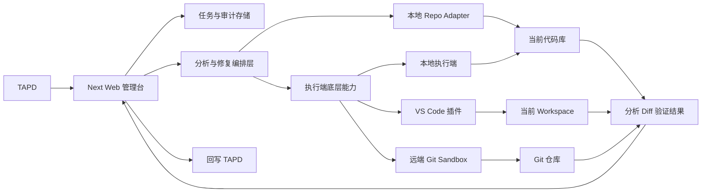
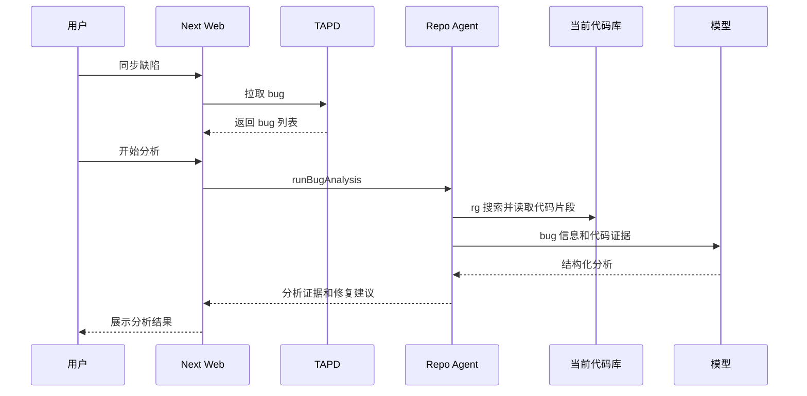
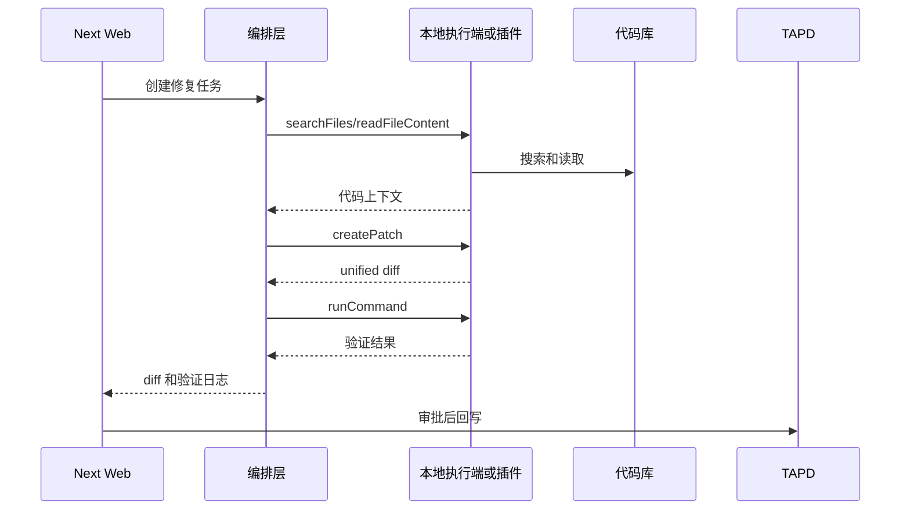

# Web + 本地执行端/插件架构方案

## 产品形态

采用混合架构，但落地顺序要从“真实本地分析”开始，而不是先抽完整跨进程协议。

- Next Web 管理台：负责 TAPD 缺陷同步、任务队列、分析/修复状态展示、审计日志、人工审批、TAPD 回写。
- 本地代码能力：第一阶段先在当前 repo 内完成搜索、读取文件、组装上下文和模型分析。
- 本地执行端：第二阶段再从 Web 进程中抽离，负责代码访问、命令执行、patch 应用等底层能力。
- VS Code 插件：第三阶段作为本地执行端的一种产品形态，优先让开发者在 IDE 里主动选择 bug 并处理。
- 远端 Git Sandbox：后续团队版执行端，在隔离环境 clone 仓库、修复、验证、创建 PR。

## 核心边界

### Web 管理台

现有页面可以继续沿用 `components/tapd-agent/bug-agent-console.tsx`，但它不直接做代码操作，只发起任务和展示结果。

现有服务层 `lib/tapd-agent/service.ts` 需要从同步函数逐步改成任务编排层：创建分析任务、创建修复任务、记录状态、接收分析证据、diff 和验证结果。

TAPD 相关能力继续放在 `lib/tapd-agent/tapd-client.ts`，保持它只负责拉 bug 和回写，不参与代码分析。

### 第一阶段本地分析能力

第一阶段不要过早定义完整 executor 协议。先在现有代码中跑通真实数据链路：

- `lib/tapd-agent/repo-agent.ts` 从假模板改成真实本地分析器。
- 从 bug 标题、描述、模块中提取可搜索的代码关键词，再用 `rg` 搜索。
- 读取候选文件片段，并尽量补齐函数级或组件级上下文，限制文件类型和最大上下文长度。
- 由 Web 编排层调用模型，生成结构化分析结果。
- `service.ts` 和 API route 改成 async。
- UI 展示真实分析证据。

这样先看到真实分析输出的数据形状，再设计稳定的执行端协议。

### 执行端底层能力

第二阶段再抽象执行端协议，并且不要把 `analyzeBug` 作为 executor 原子能力。executor 应只暴露底层代码能力，模型调用和任务状态推进留给 Web 编排层或独立 orchestrator。

建议底层能力：

- `getWorkspaceInfo()`：返回仓库路径、分支、commit、package manager。
- `searchFiles(query, globs)`：搜索代码和文本。
- `readFileContent(path, range)`：读取受限文件内容。
- `runCommand(command, cwd, timeout)`：运行白名单命令。
- `createPatch(changes)`：生成 unified diff。
- `applyPatch(diff)`：用户确认后应用 unified diff。
- `getGitInfo()`：读取当前分支、commit、dirty 状态。

编排层负责：

- 根据 bug 信息决定搜索关键词和文件范围。
- 汇总代码证据并调用模型。
- 解析结构化输出。
- 推进任务状态和审计日志。
- 决定何时生成 patch、运行验证、回写 TAPD。

### 本地执行端

本地执行端是第二阶段目标。它可以是独立 Node 进程，也可以先由 VS Code 插件内嵌。

它负责：

- 限制 repo 根目录，避免任意读写文件。
- 使用 `rg` 搜索代码。
- 读取候选文件片段。
- 生成或应用 unified diff。
- 在 worktree 或临时分支里运行验证命令。
- 将执行日志和结果返回 Web 编排层。

### VS Code 插件

插件不要一开始承载全部产品，而是作为执行端之一。

第一版建议做拉模式：

- 插件登录或绑定 TAPD / Web。
- 插件直接查询 TAPD bug，或从 Web 获取 bug 列表。
- 开发者在插件内主动选择 bug。
- 插件基于当前 workspace 执行分析和修复。
- 用 VS Code diff editor 展示 unified diff。
- 支持打开疑似文件、应用修改、运行验证命令。
- 将分析结果、diff、验证结果同步回 Web。

第二版再做推模式：

- Web 派发任务。
- 插件接单执行。
- Web 展示插件在线状态和任务进度。

### 远端 Git Sandbox

后续团队正式版可以增加 `gitSandboxExecutor`：

- 根据 bug 绑定的 repo 信息 clone 仓库。
- 创建隔离 worktree 或容器。
- 暴露与本地执行端一致的底层能力。
- 生成 unified diff 并运行验证。
- 创建 PR。
- 把 PR 链接、diff 摘要、验证日志回传 Web。

## 数据模型建议

第一阶段先扩展业务类型，不急着固化跨进程协议：

- `AnalysisInput`：bug 信息、可选模块 hint、搜索配置、提取后的搜索关键词。
- `AnalysisEvidence`：文件路径、代码片段、函数或组件级上下文、命中原因、相关度。
- `AnalysisOutput`：摘要、置信度、疑似文件、证据、复现计划、修复建议、阻塞信息。
- `PatchOutput`：统一使用 unified diff、变更文件列表、摘要、风险说明。
- `VerificationResult`：命令、状态、exit code、输出、开始时间、结束时间。

后续扩展 `lib/tapd-agent/types.ts`：

- `CodeWorkspace`：repo 类型、本地路径或远端 URL、分支、commit。
- `AgentAnalysis`：增加 `evidence`。
- `FixAttempt`：增加 `diff`、`baseBranch`、`headBranch`、`commitSha`、`executorType`。
- `RuntimeStep`：增加开始时间、结束时间、exit code。
- `ExecutorLog`：记录执行端日志，方便 Web 展示和排错。

## 搜索关键词策略

第一阶段不能直接拿中文 bug 标题全文去 `rg`，需要先把 bug 文本转成更可能命中代码的关键词。

建议先用简单规则：

- 提取英文 token：如 `reset`、`filter`、`refresh`、`channel`、`marketing`。
- 提取路径片段：如 `/channel`、`/marketing`、`channel-management`。
- 提取可能的组件词：如 `Filter`、`ResetButton`、`ChannelManagement`。
- 建立少量中文动作词映射：如“重置”对应 `reset`，“筛选”对应 `filter`，“刷新”对应 `refresh`，“提交”对应 `submit`。
- 建立业务模块词映射：如“达人营销”、“频道管理”对应可能的目录名、路由名、组件名前缀。
- 关键词分组搜索：先搜英文 token 和路径，再搜模块映射词，最后搜中文文案。

后续可以升级为模型关键词提取，但第一阶段先用规则，保证可控、可调试。

## 任务流

### 第一阶段本地 MVP

### 后续执行端形态

## 分阶段落地

### 第一阶段：真实本地分析 MVP

目标是证明“bug 信息 + 当前代码库 + 模型分析”能输出可信的分析证据。不做插件，不抽完整 executor，不急着自动改代码。

- 保留现有 Web UI 和 TAPD 同步。
- 将 `repo-agent.ts` 的 `analyzeBug` 改成 async。
- 第一版搜索使用 `rg`，暂不引入 embedding。
- 定义 `AnalysisEvidence` 类型，扩展 `AgentAnalysis`。
- 先从 bug 文本提取可搜索代码关键词，再搜索候选文件并读取受限代码片段。
- 收集证据时尽量保存完整函数或组件级上下文，为第二阶段生成 diff 做准备。
- 调用模型生成结构化分析结果。
- `service.ts` 和 route 改成 async / await。
- Web UI 展示分析证据：文件、片段、命中原因。

### 第二阶段：生成 unified diff

目标是开始进入“修复 bug”，但仍然保持人工确认，不自动提交。

- 明确 `FixAttempt.diff` 使用 unified diff。
- diff 生成输入必须包含 bug 信息、第一阶段分析结果、疑似文件、原始代码、函数或组件级上下文。
- 让模型基于分析结果和原始代码输出具体修改方案，再由程序基于真实文件内容生成 unified diff。
- 生成 diff 并展示在 Web，避免只展示模型自由生成的伪 diff。
- 暂不自动应用 patch，用户确认后再执行。
- 记录变更文件、风险说明和审计日志。

### 第三阶段：验证命令和本地执行端抽象

目标是把代码访问和命令执行从 Web 编排逻辑中拆出来。

- 定义底层 executor 能力：搜索、读文件、运行命令、生成 patch、应用 patch、读取 git 信息。
- 做本地 Node executor 或插件内嵌 executor。
- Web 通过 HTTP、WebSocket 或本地 token 调用 executor。
- executor 负责 repo 授权、路径限制、命令白名单。
- 支持 `pnpm check`、`pnpm test`、`pnpm build` 的白名单验证。

### 第四阶段：VS Code 插件

目标是把代码操作体验放进 IDE。

- 插件第一版做拉模式，开发者主动选择 bug。
- 插件复用底层 executor 能力。
- 插件展示分析证据和 unified diff。
- 插件支持应用 patch、打开文件、运行验证。
- 插件把结果同步回 Web。
- 第二版再做 Web 派单和插件接单。

### 第五阶段：远端 Git Sandbox

目标是支持团队自动化。

- bug 绑定 repo 和默认分支。
- 服务端在隔离环境 clone 仓库。
- 复用 executor 底层能力。
- 运行分析、修复、验证。
- 创建 PR 并回传链接。
- 审批后回写 TAPD。

## Todo List

- [ ] 将 `repo-agent.ts` 的 `analyzeBug` 改成 async，为真实分析链路做准备。
- [ ] 定义 `AnalysisEvidence`，扩展 `AgentAnalysis`，支持文件路径、代码片段、函数或组件级上下文、命中原因和相关度。
- [ ] 设计搜索关键词提取策略：从中文标题和描述中提取英文 token、路径片段、组件词、业务模块映射词和中文文案。
- [ ] 实现本地代码搜索：使用 `rg` 根据提取后的关键词分组搜索候选文件。
- [ ] 实现受限文件读取：限制 repo 根目录、文件类型、最大文件数和最大片段长度。
- [ ] 补齐函数或组件级上下文：为第二阶段生成 diff 保留足够的原始代码上下文。
- [ ] 接入模型调用：用 bug 信息和代码证据生成结构化分析结果。
- [ ] 将 `service.ts` 的 `runBugAnalysis` 改成 async，并同步调整 analyze route。
- [ ] 升级 Bug Agent Console，展示分析证据列表。
- [ ] 跑通第一阶段真实分析链路后，再设计 patch 生成流程。
- [ ] 明确 `FixAttempt.diff` 使用 unified diff，并实现 diff 展示。
- [ ] 实现修复任务的 diff 生成流程：输入 bug 信息、分析结果、疑似文件和函数/组件级原始代码，第一版只展示 diff，不自动提交。
- [ ] 实现验证命令白名单和结果采集，优先支持 `pnpm check`、`pnpm test`、`pnpm build`。
- [ ] 抽象 executor 底层能力：搜索、读文件、运行命令、生成 patch、应用 patch、读取 git 信息。
- [ ] 将本地执行能力从 Web 进程中抽离为独立 Node executor，并设计本地鉴权方式。
- [ ] 设计 VS Code 插件最小能力：拉取或选择 bug、调用 executor、展示 diff、应用 patch、回传结果。
- [ ] 预留远端 Git Sandbox executor，实现 repo/branch/commit 绑定和 PR 创建能力的接口。

## 风险与原则

- 第一阶段先获取真实分析数据，再抽 executor 协议，避免过早锁死接口。
- 模型调用权优先留在 Web 编排层或独立 orchestrator，避免每种 executor 都必须持有模型 key。
- 不要在 Next API route 里直接跑长时间 clone/build/test，后续要任务队列或独立 executor。
- 不要让 Web 任意读写本地文件，必须通过用户明确授权的 executor。
- 修复功能第一版不要自动提交，先展示 unified diff 并人工确认。
- 搜索第一版使用 `rg`，暂不引入 embedding 或复杂索引。
- `rg` 搜索前必须先做关键词提取，避免中文标题全文无法命中代码。
- 第一阶段证据收集要保留函数或组件级上下文，避免第二阶段生成 diff 时上下文不足。
- 命令执行必须白名单，比如 `pnpm check`、`pnpm test`、`pnpm build`。
- Web、插件、远端 sandbox 后续要共用同一套底层执行能力，避免重写。
